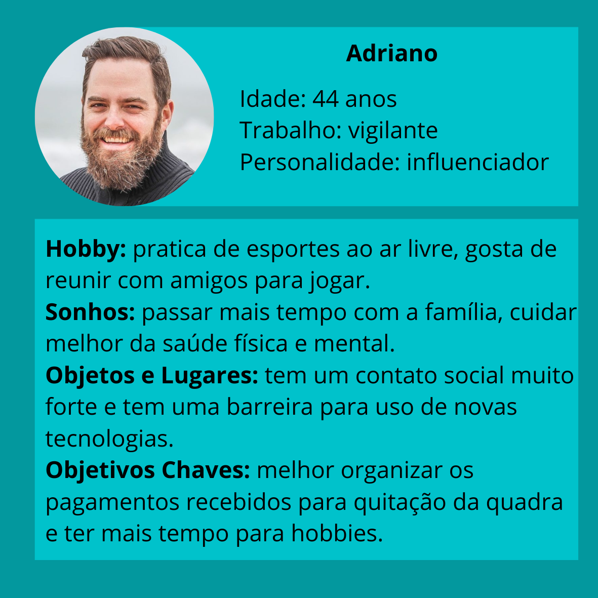
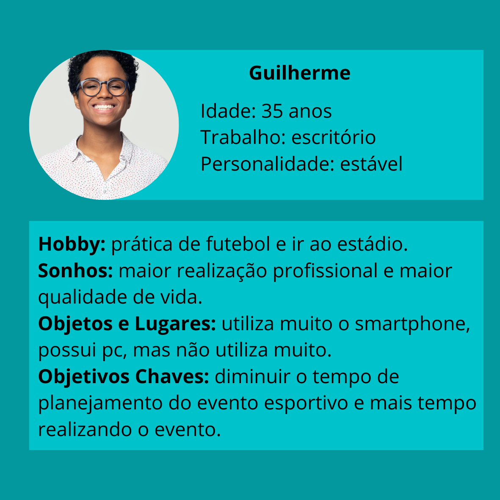

# Sport Match

Curso Ciência da Computação 

## Participantes
<ul>
  <li>Allan Guilherme Gomes Pego</li>
  <li>Bernardo Ribeiro Martins</li>
  <li>Felipe Assis Michalaros </li>
  <li>Leticia Guimarães Pedrosa</li>
  <li>Pedro Augusto Etelvino Albuquerque </li>
  <li>Vitoria Avany Gallo Motta </li>
</ul>

# Estrutura do Documento

- [Informações do Projeto](#informações-do-projeto)
  - [Participantes](#participantes)
- [Estrutura do Documento](#estrutura-do-documento)
- [Introdução](#introdução)
  - [Problema](#problema)
  - [Objetivos](#objetivos)
  - [Justificativa](#justificativa)
  - [Público-Alvo](#público-alvo)
- [Especificações do Projeto](#especificações-do-projeto)
  - [Personas e Mapas de Empatia](#personas-e-mapas-de-empatia)
  - [Histórias de Usuários](#histórias-de-usuários)
  - [Requisitos](#requisitos)
    - [Requisitos Funcionais](#requisitos-funcionais)
    - [Requisitos não Funcionais](#requisitos-não-funcionais)
  - [Restrições](#restrições)
- [Projeto de Interface](#projeto-de-interface)
  - [User Flow](#user-flow)
  - [Wireframes](#wireframes)
- [Metodologia](#metodologia)
  - [Divisão de Papéis](#divisão-de-papéis)
  - [Ferramentas](#ferramentas)
  - [Controle de Versão](#controle-de-versão)
- [Projeto da Solução](#projeto-da-solução)
  - [Tecnologias Utilizadas](#tecnologias-utilizadas)
  - [Arquitetura da solução](#arquitetura-da-solução)
- [Avaliação da Aplicação](#avaliação-da-aplicação)
  - [Plano de Testes](#plano-de-testes)
  - [Ferramentas de Testes (Opcional)](#ferramentas-de-testes-opcional)
  - [Registros de Testes](#registros-de-testes)
- [Referências](#referências)

# Introdução
A socialização é uma necessidade primordial a todas as pessoas, desde a infância até a velhice. Ela é fundamental para o bem-estar social e saúde emocional dos indivíduos. 
Uma boa estratégia para promove-lo é a prática esportiva realizada em grupo. Vale ressaltar ainda que os esportes coletivos, sempre presentes de forma marcante na sociedade brasileira, servem de descontração, diante de rotinas estressantes. Ademias, a utilização desse entretenimento possibilita diversos benefícios à saúde física e mental.
Nota-se que, apesar dos diversos benefícios causados pela prática de esportes, ainda existem alguns fatores que dificultam a mesma. Comprova-se tal situação com a dificuldade de reunir pessoas com mesmos interesses esportivos, como montar uma equipe de futebol completa em um mesmo ambiente. Sendo assim, os alunos da PUC Minas, propõem um projeto para a resolução dessa problemática. 

## Problema
O problema que se busca resolver com este projeto é a dificuldade que grande parte das pessoas têm em encontrar parceiros para a realização de atividades físicas e, além disso, marcar esses eventos esportivos. Por meio das pesquisas e entrevistas realizadas pelo grupo, constatou-se a ausência de softwares capazes de conectar pessoas com objetivo similares, no âmbito esportivo, de forma eficiente. Além disso, é notável a existência de uma grande parcela de pessoas que deixam de exercitar-se por causa dessa dificuldade.

## Objetivos
O objetivo geral deste trabalho é a criação de um app que facilite a organização e a marcação de práticas esportivas.

Como objetivos específicos, podemos ressaltar:
  - Fornecer diversas opções ao usuário de eventos para a realização de esportes.
  - Possibilitar ao usuário a criação de eventos para práicas esportivas.
  - Encontrar novos parceiros de jogo.

## Justificativa
De acordo com o IBGE, Instituto Brasileiro de Geografia e Estatística, 40,3% dos adultos são considerados sedentários no Brasil. Este dado comprova que grande parte da população necessita de incentivo ou possui dificuldades para realização atividades físicas. As práticas esportivas, mesmo que de forma amadora, são fundamentais à saúde física e mental, em virtude de ser capaz de trazer inúmeros privilégios ao corpo e à mente das pessoas em seu cotidiano, além de reduzir riscos de aparecimento de doenças. Por isso, visando incentivar e facilitar a organização de encontros para práticas esportivas, os alunos da PUC Minas decidiram criar um ambiente que favoreça o encontro de pessoas com interesses similares e auxilie na marcação dos eventos.

## Público-Alvo
O foco deste trabalho está em suprir a necessidade das pessoas de encontrar eventos para práticas esportivas. Sendo assim, o público alvo pode ser definido como mulheres e homens, que moram em Belo Horizonte, com idade entre 15 e 60 anos, que buscam praticar esportes coletivos em seus momentos de lazer.

 
# Especificações do Projeto
Foi feita uma pesquisa com diferentes pessoas que se enquadram no público alvo do projeto, a qual tinha como objetivo identificar os principais aspectos que desmotivam e dificultam a prática esportiva em grupo. A partir dos resultados obtidos, foram elaboradas duas personas.
 

## Personas e Mapas de Empatia

Temos duas personas em mente, uma que tem maior aptidão para novas ferramentas e outra que é mais tolerante para iniciar o uso de nova ferramenta. O desafio com a segunda persona é trazê-lo para usar a ferramenta, após esta quebra de gelo inicial, este está muito mais propenso a continuar a usá-la, sendo o desafio inicial um empecilho também para a saída deste usuário. Um desafio grande é criar o interesse no usuário, e um desafio ainda maior e mais importante é retê-lo satisfeito, pois um usuário que não está satisfeito além de deixar de usar o seu serviço ainda tornar-se-á um detrator, fazendo propaganda negativa.

## Persona 1
	
| PERSONA| Persona 1                                                                                               |
|------------------|-----------------------------------------------------------------------------------------------|
| nome             | adriano                                                                                       |
| idade            | 44 anos                                                                                       |
| hobby            | pratica de esportes ao ar livre, gosta de reuinir com amigos para jogar                       |
| trabalho         | vigilante                                                                                     |
| personalidade    | influenciador                                                                                 |
| sonhos           | passar mais tempo com a família, cuidar melhor da saúde física e mental                       |
| objetos e lugares| tem um contato social muito forte e tem uma barreira para uso de novas tecnologias            |
|objetivos chaves  | melhor organizar os pagamentos recebidos para quitação da quadra e ter mais tempo para hobbies|

> 

## Persona 2
	
| PERSONA| persona 2 	                                                                                           |
|------------------|-----------------------------------------------------------------------------------------------|
| nome             | Guilherme                                                                                     |
| idade            | 35 anos                                                                                       |
| hobby            | pratica de futebol e ir ao estádio                                                            |
| trabalho         | escritório                                                                                    |
| personalidade    | estável                                                                                       |
| sonhos           | maior realização profissional e maior qualidade de vida                                       |
| objetos e lugares| utiliza muito o smartphone, possui pc, mas não utiliza muito                                  |
|objetivos chaves  | diminuir o tempo de planejamento do evento esportivo e mais tempo realizando o evento         |

> 
> 

## Histórias de Usuários

Com base na análise das personas forma identificadas as seguintes histórias de usuários:

   |EU COMO... `PERSONA`| QUERO/PRECISO ... `FUNCIONALIDADE` |PARA ... `MOTIVO/VALOR`                 |
   |--------------------|------------------------------------|----------------------------------------|
   |Usuário do sistema  | fazer login                        | Utilizar a plataforma                  |
1  |Usuário do sistema  | exibir/editar perfil               | Encontrar novos parceiros              |
2  |Usuário do sistema  | cadastrar/editar novo local        | marcar eventos                         |
3  |Usuário do sistema  | cadastrar nova partida             | praticar esportes                      |
4  |Usuário do sistema  | consultar partidas diponíveis      | encontrar um horário viável            |
5  |Usuário do sistema  | confirmar a presença em uma partida| praticar esportes                      |
6  |Usuário do sistema  | cancelar a presença em uma partida | caso algum imprevisto ocorra           |
7  |Usuário do sistema  | consultar minhas partidas          | lembrar dos jogos marcados             |
8  |Usuário do sistema  | Eventos em alta                    | lembrar dos jogos marcados             |
9  |Usuário do sistema  | Avaliar eventos passados           | ajudar usuarios e escolhoer eventos    |
10 |Usuário do sistema  | Exibir detalhes do evento          |                                        |
11 |Usuário do sistema  | Avaliar  participantes             | ajudar usuarios e escolhoer eventos    |
12 |Usuário do sistema  | Editar detalhes do evento          | ajudar usuarios e escolhoer eventos    |
1  |Administrador       | Alterar permissões                 | administrar contas                     |

## Requisitos

As tabelas que se seguem apresentam os requisitos funcionais e não funcionais que detalham o escopo do projeto.

### Requisitos Funcionais

|ID    | Descrição do Requisito  | Prioridade |
|------|-----------------------------------------|----|
|RF-001| Confirmar e cancelar presença | BAIXA | 
|RF-002| Editar perfil | MÉDIA |
|RF-003| Exibir perfil | MÉDIA |
|RF-004| Cadastar local | ALTA |
|RF-005| Cadastrar evento | ALTA |
|RF-006| Consultar minhas partidas | MÉDIA |
|RF-007| Exibir evento | ALTA |
|RF-008| Exibir local | ALTA |
|RF-009| Cadastrar time | BAIXA |
|RF-010| Eventos em Alta | BAIXA |
|RF-011| Exibir detalhes do evento | MÉDIA |
|RF-012| Exibir detalhes do local | BAIXA |

### Requisitos não Funcionais

|ID     | Descrição do Requisito  |Prioridade |
|-------|-------------------------|----|
|RNF-001| Template | ALTA |

## Restrições

O projeto está restrito pelos itens apresentados na tabela a seguir.

|ID| Restrição                                             |
|--|-------------------------------------------------------|
|01| O projeto deverá ser entregue até o final do semestre |
|02| Não pode ser desenvolvido um módulo de backend        |

# Projeto de Interface

> Foi desenvolvido um projeto de interface que proporciona aos usuário o planejamento e a marcação de eventos esportivos.

## User Flow
> 
> O diagrama apresentado a seguir mostra o fluxo de interação do usuário pelas telas do sistema. Cada uma das telas deste fluxo é detalhada na seção de Wireframes.
> 
> 
> 
## Wireframes
> Conforme o fluxo de telas do projeto, apresentado no item anterior, as telas do sistema são apresentadas em detalhes nos itens a seguir: 
> [Protótipo Interativo](https://marvelapp.com/prototype/e2chaa3/screen/88748564)
> 
> **Home**:
> 
> 
> 
> **Sign Up**:
> 
> 
> 
> **Sign In**:
> 
> 
> 
> **Search**:
> 
> 
> 
> **Perfil**:
> 
> 
> 
> **Adicionar Esporte**:
> 
> 
> 
> **Informações do Esporte**:
> 
> 

# Metodologia

> A metodologia do processo se baseia na organização do grupo e nas ferramentas utilizadas para a realização do trabalho.

## Divisão de Papéis
> O grupo possui seis integrantes: 
> 
| Aluno  | Função              |
|-----------|-------------------------|
| Allan Guilherme Gomes Pego  | Front-End |
| Bernardo Ribeiro Martins  | Front-End e Apresentação | 
| Felipe Assis Michalaros | Front-End |
| Leticia Guimarães Pedrosa | Front-End e Documentação |
| Pedro Augusto Etelvino Albuquerque  | Front-End e Apresentação |
| Vitoria Avany Gallo Motta | Front-End |

## Ferramentas

| Ambiente  | Plataforma              |Link de Acesso |
|-----------|-------------------------|---------------|
|Processo de Design Thinkgin  | Miro | https://miro.com/app/board/uXjVPXvl5UI=/?share_link_id=689205176516 | 
|Repositório de código | GitHub | https://github.com/XXXXXXX | 
|Hospedagem do site | Heroku | | 
|Protótipo Interativo | MavelApp ou Figma | https://marvelapp.com/prototype/e2chaa3/screen/88748564 |
|quadro interátivo para kanban | trello | https://trello.com/invite/b/vBmy2Xzy/9f66c0234cabedc15be91518a86a8708/sports-match |
> 
> As ferramentas empregadas no projeto são:
	• Editor de código: O editor vscode foi escolhido porque ele possui uma integração com o sistema de versão.
	• Ferramentas de comunicação: A ferramenta de comunicação whatsapp foi escolhida uma vez que ela já está fortemente ligada ao dia a dia dos participantes.
	• Ferramentas de diagramação: Para criar diagramas utilizamos o Miro por melhor captar as necessidades da nossa solução.
	• Plataforma de hospedagem: Herokuapp foi escolhida por ser uma hospedagem gratuita de fácil utilização.

## Controle de Versão

> O projeto está hospedado no github todos os participantes possuem acesso a leitura e 
> escrita, porem para evitar possiveis problemas com sobreescrita de dados cada colaborador
> irá fazer suas edições em sua própria branch e depois efetuar o merge para master.
> A ferramenta de controle de versão adotada no projeto foi o
> [Git](https://git-scm.com/), sendo que o [Github](https://github.com)
> foi utilizado para hospedagem do repositório `origin`.
> 
> O projeto segue a seguinte convenção para o nome de branchs:
> 
> - `master`: versão estável já testada do software
> - `homolog`: versão em testes do software
> - `dev`: versão de desenvolvimento do software
> 
> Quanto à gerência de issues, o projeto adota a seguinte convenção para
> etiquetas:
> 
> - `bugfix`: uma funcionalidade encontra-se com problemas
> - `enhancement`: uma funcionalidade precisa ser melhorada
> - `feature`: uma nova funcionalidade precisa ser introduzida
>
>
>
> 

# **############## SPRINT 1 ACABA AQUI #############**

# Projeto da Solução

Nesta seção são apresentados os detalhes técnicos da solução criada pelo grupo, tratando da arquitetura da solução, das estruturas de dados e das telas já implementadas.

## Tecnologias Utilizadas

Para implementar a solução do projeto, foram utilizadas diversas tecnologias para a resolução do projeto:
	• HTML (HyperText Markup Language) que é o componente básico da web, assim, ele permite inserir o conteúdo e estabelecer a estrutura básica do site, 
	• CSS (Cascading Style Sheets) é um mecanismo para adicionar estilo a um documento web, assim, foi possível desenvolver o design do site.
	• JavaScript foi a linguagem de programação utilizada pelos alunos para a realização dos requisitos pré-definidos do site.
	• JSON (JavaScript Object Notation) é um padrão de formatação de dados para troca de informações entre sistemas. Por isso, foi utilizado para a integração das informações trocadas entre os requisitos.

## Arquitetura da solução

A solução contém os seguintes módulos: 
1. Tecnologias Utilizadas: HTML, CSS e Java Script.
2. Páginas Web: Conjunto de arquivos HTML, CSS, JavaScript desenvolvidos pelos alunos que implementam as funcionalidades do sistema.
3. Local Storage: a funcionalidade do localStorage consiste em salvar, adicionar, recuperar ou excluir dados localmente no navegador Web onde são implementados bancos de dados baseados em JSON. 
	• Cadastro e Login: informações cadastradas pelos usuários.
	• Cadastro de Eventos: informações cadastradas pelos usuários ao criar um novo evento esportivo.
	• Cadastro de Lugares: informações cadastradas pelos usuários ao criar um novo lugar, onde é possível a realização de práticas esportivas.
	• Cadastro de Time: informações cadastradas pelos usuários ao criar uma nova equipe.
4. Navegador: habilita os usuários a interagirem com os documentos HTML hospedados em um servidor da rede.
5. Usuários: pessoas que usufruirão do site desenvolvido pelos alunos.

# Avaliação da Aplicação

Nessa seção, apresenta-se o processo de realização dos testes da solução desenvolvida no projeto. Assim, exibe os planos de testes e, na sequência, o registro dos testes realizados.

## Plano de Testes

## Ferramentas de Testes (Opcional)

## Registros de Testes

# Referências

Sedentarismo atinge 47% dos brasileiros – 2022. https://www.unimedcuritiba.com.br/noticias/sedentarismo-atinge-47-dos-brasileiros#:~:text=Segundo%20dados%20do%20Instituto%20Brasileiro,ainda%20mais%20alarmante%3A%2084%25.
Os oito benefícios mentais do esporte – 2018. https://ge.globo.com/eu-atleta/saude/noticia/os-8-principais-beneficios-mentais-dos-esportes.ghtml

