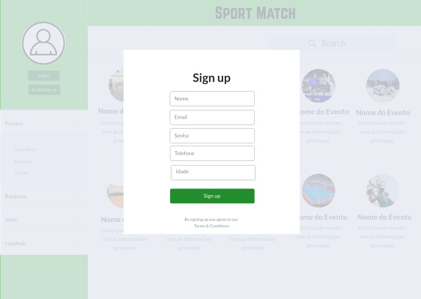
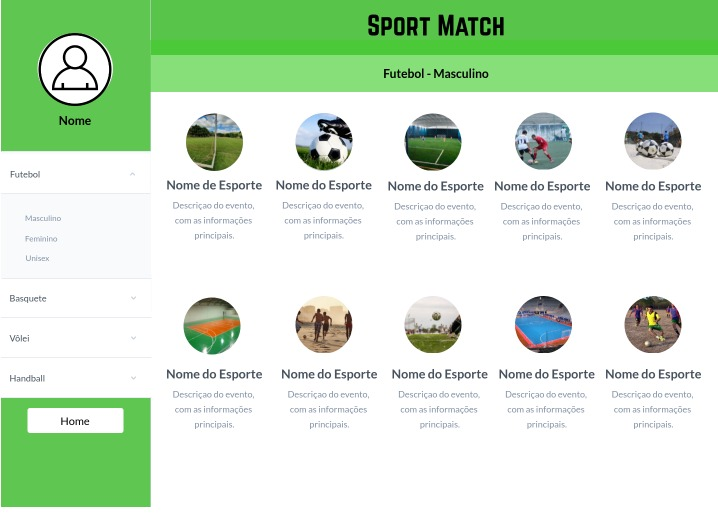
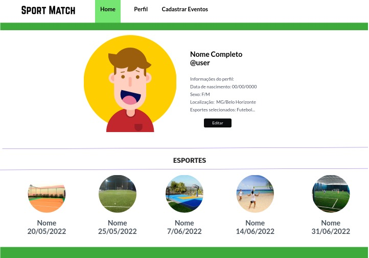

# Sport Match

Curso Ciência da Computação 

## Participantes
<ul>
  <li>Allan Guilherme Gomes Pego</li>
  <li>Bernardo Ribeiro Martins</li>
  <li>Felipe Assis Michalaros </li>
  <li>Leticia Guimarães Pedrosa</li>
  <li>Pedro Augusto Etelvino Albuquerque </li>
  <li>Vitoria Avany Gallo Motta </li>
</ul>

# Estrutura do Documento

- [Informações do Projeto](#informações-do-projeto)
  - [Participantes](#participantes)
- [Estrutura do Documento](#estrutura-do-documento)
- [Introdução](#introdução)
  - [Problema](#problema)
  - [Objetivos](#objetivos)
  - [Justificativa](#justificativa)
  - [Público-Alvo](#público-alvo)
- [Especificações do Projeto](#especificações-do-projeto)
  - [Personas e Mapas de Empatia](#personas-e-mapas-de-empatia)
  - [Histórias de Usuários](#histórias-de-usuários)
  - [Requisitos](#requisitos)
    - [Requisitos Funcionais](#requisitos-funcionais)
    - [Requisitos não Funcionais](#requisitos-não-funcionais)
  - [Restrições](#restrições)
- [Projeto de Interface](#projeto-de-interface)
  - [User Flow](#user-flow)
  - [Wireframes](#wireframes)
- [Metodologia](#metodologia)
  - [Divisão de Papéis](#divisão-de-papéis)
  - [Ferramentas](#ferramentas)
  - [Controle de Versão](#controle-de-versão)
- [Projeto da Solução](#projeto-da-solução)
  - [Tecnologias Utilizadas](#tecnologias-utilizadas)
  - [Arquitetura da solução](#arquitetura-da-solução)
- [Avaliação da Aplicação](#avaliação-da-aplicação)
  - [Plano de Testes](#plano-de-testes)
  - [Ferramentas de Testes (Opcional)](#ferramentas-de-testes-opcional)
  - [Registros de Testes](#registros-de-testes)
- [Referências](#referências)

# Introdução
  Ao organizar-se para um esporte coletivo, é um fardo do organizador, tentar encontrar um horário que satisfaça a um grupo mínimo de participantes para possibilitar a realização do evento. Como exemplo o futebol, o ideal relatado nas entrevistas é que tenha-se no mínimo três times, para que haja período de descanso otimizado entre as partidas ( um time descansa enquanto dois jogam). Como custo deste problema, diminui-se a quantidade de jogos possíveis e torna o processo moroso para todos, diminuindo a qualidade de sua experiência.

## Problema
O problema que se busca resolver com este projeto é a dificuldade que grande parte das pessoas encontra em encontrar parceiros e marcar práticas esportivas.

## Objetivos
O objetivo geral deste trabalho é a criação de um app que facilite a organização e a marcação de práticas esportivas.

Como objetivos específicos, podemos ressaltar:
  - Fornecer diversas opções ao usuário de eventos para a realização de esportes.
  - Possibilitar ao usuário a criação de eventos para práicas esportivas.
  - Encontrar novos parceiros de jogo.

## Justificativa
Atualmente, muitas pessoas de diferentes idades apresentam dificuldades em organizar encontros para práticas esportivas por diversos motivos. Portanto decidimos criar de um ambiente que favoreça encontro de pessoas com interesses similares e auxilie na organização dos eventos.

## Público-Alvo
O foco deste trabalho está em suprir a necessidade das pessoas de encontrar eventos para práticas esportivas. Sendo assim, o público alvo pode ser definido como mulheres e homens, que moram em Belo Horizonte, com idade entre 15 e 60 anos, que buscam praticar esportes coletivos em seus momentos de lazer.

 
# Especificações do Projeto
 Nessa parte da documentação vamos falar sobre as personas e o mapa de empatia, histórias de usuários, requisitos e restrições. utilizou-se ferramentas virtuais
 como o miro para a concepção das personas.
 

## Personas e Mapas de Empatia

Temos duas personas em mente, uma que tem maior aptidão para novas ferramentas e outra que é mais tolerante para iniciar o uso de nova ferramenta. O desafio com a segunda persona é trazê-lo para usar a ferramenta, após esta quebra de gelo inicial, este está muito mais propenso a continuar a usá-la, sendo o desafio inicial um empecilho também para a saída deste usuário. 	
	Um desafio grande é criar o interesse no usuário, e um desafio ainda maior e mais importante é retê-lo satisfeito, pois um usuário que não está satisfeito além de deixar de usar o seu serviço ainda tornar-se-á um detrator, fazendo propaganda negativa. 
	
| PERSONA| Persona 1                                                                                               |
|------------------|-----------------------------------------------------------------------------------------------|
| nome             | adriano                                                                                       |
| idade            | 44 anos                                                                                       |
| hobby            | pratica de esportes ao ar livre, gosta de reuinir com amigos para jogar                       |
| trabalho         | vigilante                                                                                     |
| personalidade    | influenciador                                                                                 |
| sonhos           | passar mais tempo com a família, cuidar melhor da saúde física e mental                       |
| objetos e lugares| tem um contato social muito forte e tem uma barreira para uso de novas tecnologias            |
|objetivos chaves  | melhor organizar os pagamentos recebidos para quitação da quadra e ter mais tempo para hobbies|
	
	
| PERSONA| persona 2 	                                                                                           |
|------------------|-----------------------------------------------------------------------------------------------|
| nome             | Guilherme                                                                                     |
| idade            | 35 anos                                                                                       |
| hobby            | pratica de futebol e ir ao estádio                                                            |
| trabalho         | escritório                                                                                    |
| personalidade    | estável                                                                                       |
| sonhos           | maior realização profissional e maior qualidade de vida                                       |
| objetos e lugares| utiliza muito o smartphone, possui pc, mas não utiliza muito                                  |
|objetivos chaves  | diminuir o tempo de planejamento do evento esportivo e mais tempo realizando o evento         |
> 
> 
> **Exemplo de Persona**
> 
> 
> 

## Histórias de Usuários

Com base na análise das personas forma identificadas as seguintes histórias de usuários:

   |EU COMO... `PERSONA`| QUERO/PRECISO ... `FUNCIONALIDADE` |PARA ... `MOTIVO/VALOR`                 |
   |--------------------|------------------------------------|----------------------------------------|
   |Usuário do sistema  | fazer login                        | Utilizar a plataforma                  |
1  |Usuário do sistema  | exibir/editar perfil               | Encontrar novos parceiros              |
2  |Usuário do sistema  | cadastrar/editar novo local        | marcar eventos                         |
3  |Usuário do sistema  | cadastrar nova partida             | praticar esportes                      |
4  |Usuário do sistema  | consultar partidas diponíveis      | encontrar um horário viável            |
5  |Usuário do sistema  | confirmar a presença em uma partida| praticar esportes                      |
6  |Usuário do sistema  | cancelar a presença em uma partida | caso algum imprevisto ocorra           |
7  |Usuário do sistema  | consultar minhas partidas          | lembrar dos jogos marcados             |
8  |Usuário do sistema  | Eventos em alta                    | lembrar dos jogos marcados             |
9  |Usuário do sistema  | Avaliar eventos passados           | ajudar usuarios e escolhoer eventos    |
10 |Usuário do sistema  | Exibir detalhes do evento          |                                        |
11 |Usuário do sistema  | Avaliar  participantes             | ajudar usuarios e escolhoer eventos    |
12 |Usuário do sistema  | Editar detalhes do evento          | ajudar usuarios e escolhoer eventos    |
1  |Administrador       | Alterar permissões                 | administrar contas                     |

## Requisitos

As tabelas que se seguem apresentam os requisitos funcionais e não funcionais que detalham o escopo do projeto.

### Requisitos Funcionais

|ID    | Descrição do Requisito  | Prioridade |
|------|-----------------------------------------|----|
|RF-001| Permitir que o usuário cadastre tarefas | ALTA | 
|RF-002| Emitir um relatório de tarefas no mês   | MÉDIA |

### Requisitos não Funcionais

|ID     | Descrição do Requisito  |Prioridade |
|-------|-------------------------|----|
|RNF-001| O sistema deve ser responsivo para rodar em um dispositivos móvel | MÉDIA | 
|RNF-002| Deve processar requisições do usuário em no máximo 3s |  BAIXA | 

> Com base nas Histórias de Usuário, enumere os requisitos da sua
> solução. Classifique esses requisitos em dois grupos:
>
> - [Requisitos Funcionais (RF)](https://pt.wikipedia.org/wiki/Requisito_funcional):
>   correspondem a uma funcionalidade que deve estar presente na
>   plataforma (ex: cadastro de usuário).
>
> - [Requisitos Não Funcionais (RNF)](https://pt.wikipedia.org/wiki/Requisito_n%C3%A3o_funcional):
>   correspondem a uma característica técnica, seja de usabilidade,
>   desempenho, confiabilidade, segurança ou outro (ex: suporte a
>   dispositivos iOS e Android).
>
> Lembre-se que cada requisito deve corresponder à uma e somente uma
> característica alvo da sua solução. Além disso, certifique-se de que
> todos os aspectos capturados nas Histórias de Usuário foram cobertos.
> 
> **Links Úteis**:
> 
> - [O que são Requisitos Funcionais e Requisitos Não Funcionais?](https://codificar.com.br/requisitos-funcionais-nao-funcionais/)
> - [O que são requisitos funcionais e requisitos não funcionais?](https://analisederequisitos.com.br/requisitos-funcionais-e-requisitos-nao-funcionais-o-que-sao/)

## Restrições

O projeto está restrito pelos itens apresentados na tabela a seguir.

|ID| Restrição                                             |
|--|-------------------------------------------------------|
|01| O projeto deverá ser entregue até o final do semestre |
|02| Não pode ser desenvolvido um módulo de backend        |

# Projeto de Interface

> Foi desenvolvido um projeto de interface que proporciona aos usuário o planejamento e a marcação de eventos esportivos.

## User Flow
> 
> O diagrama apresentado a seguir mostra o fluxo de interação do usuário pelas telas do sistema. Cada uma das telas deste fluxo é detalhada na seção de Wireframes.
> 
> 
> 
## Wireframes
> Conforme o fluxo de telas do projeto, apresentado no item anterior, as telas do sistema são apresentadas em detalhes nos itens a seguir: 
> [Protótipo Interativo](https://marvelapp.com/prototype/e2chaa3/screen/88748564)
> 
> **Home**:
> 
> 
> 
> **Sign Up**:
> 
> 
> 
> **Sign In**:
> 
> 
> 
> **Search**:
> 
> 
> 
> **Perfil**:
> 
> 
> 
> **Adicionar Esporte**:
> 
> 
> 
> **Informações do Esporte**:
> 
> 

# Metodologia

> A metodologia escolhida pelo grupo é o scrum que tem como pilares:
> - comunicação — indivíduos e interações são mais que processos e ferramentas;
> - praticidade — softwares em funcionamento são mais que documentação abrangente;
> - colaboração — a colaboração com o cliente é mais que a negociação de contratos;
> - adaptabilidade e flexibilidade — responder a mudanças é mais que seguir um plano.
> 
> ** As ferramentas utilizadas são: **
> - Backlog
> - Scrum board
>
> ** Os ritos são: ** 
> - Sprint planing
> - Stand up meeting
> - Sprint review
>
> 
> **Links Úteis**:
> - [Tutorial Trello](https://trello.com/b/8AygzjUA/tutorial-trello)
> - [Gestão ágil de projetos com o Trello](https://www.youtube.com/watch?v=1o9BOMAKBRE)
> - [Gerência de projetos - Trello com Scrum](https://www.youtube.com/watch?v=DHLA8X_ujwo)
> - [Tutorial Slack](https://slack.com/intl/en-br/)

## Divisão de Papéis

> ** O grupo possue seis integrantes: **
> - Um product owner, reposável por manter o backlog atualizado e definir as histórias da sprint
> - Um scrum master, responsável pela manutenção dos ritos e divisão de tarefas entre a equipe
> - Quatro desenvolvedores / designers
>
>
> **Links Úteis**:
> - [11 Passos Essenciais para Implantar Scrum no seu Projeto](https://mindmaster.com.br/scrum-11-passos/)
> - [Scrum em 9 minutos](https://www.youtube.com/watch?v=XfvQWnRgxG0)

## Ferramentas

| Ambiente  | Plataforma              |Link de Acesso |
|-----------|-------------------------|---------------|
|Processo de Design Thinkgin  | Miro |  https://miro.com/app/board/uXjVPXvl5UI=/?share_link_id=689205176516 | 
|Repositório de código | GitHub | https://github.com/XXXXXXX | 
|Hospedagem do site | Heroku |  https://XXXXXXX.herokuapp.com | 
|Protótipo Interativo | MavelApp ou Figma | https://figma.com/XXXXXXX |
|quadro interátivo para kanban | trello | https://trello.com/invite/b/vBmy2Xzy/9f66c0234cabedc15be91518a86a8708/sports-match |

> 
> As ferramentas empregadas no projeto são:
> 
> - Editor de código: vim e vscode
> O editor vscode foi escolhido porque ele possui uma integração com o sistema de versão.
> O editor vim foi escolhido por apresentar grande estabilidade e confiabilidade.
> - Ferramentas de comunicação: whats app
> A ferramenta de comunicação whats app foi escolhida uma vez que ela já está fortemente
> ligada ao dia a dia dos participantes. 
> - Ferramentas de diagramação: miro 
> Para criar diagramas utilizamos essa ferramenta por melhor captar as
> necessidades da nossa solução.
> - Plataforma de hospedagem: herokuapp
> Escolhida por ser uma hospedagem gratuita de fácil utilização. 
> 
> **Links Úteis - Hospedagem**:
> - [Getting Started with Heroku](https://devcenter.heroku.com/start)
> - [Crie seu Site com o HostGator](https://www.hostgator.com.br/como-publicar-seu-site)
> - [GoDady](https://br.godaddy.com/how-to)
> - [GitHub Pages](https://pages.github.com/)

## Controle de Versão

> O projeto está hospedado no github todos os participantes possuem acesso a leitura e 
> escrita, porem para evitar possiveis problemas com sobreescrita de dados cada colaborador
> irá fazer suas edições em sua própria branch e depois efetuar o merge para master.
> A ferramenta de controle de versão adotada no projeto foi o
> [Git](https://git-scm.com/), sendo que o [Github](https://github.com)
> foi utilizado para hospedagem do repositório `origin`.
> 
> O projeto segue a seguinte convenção para o nome de branchs:
> 
> - `master`: versão estável já testada do software
> - `homolog`: versão em testes do software
> - `dev`: versão de desenvolvimento do software
> 
> Quanto à gerência de issues, o projeto adota a seguinte convenção para
> etiquetas:
> 
> - `bugfix`: uma funcionalidade encontra-se com problemas
> - `enhancement`: uma funcionalidade precisa ser melhorada
> - `feature`: uma nova funcionalidade precisa ser introduzida
>
> **Links Úteis**:
> - [Tutorial GitHub](https://guides.github.com/activities/hello-world/)
> - [Git e Github](https://www.youtube.com/playlist?list=PLHz_AreHm4dm7ZULPAmadvNhH6vk9oNZA)
> - [5 Git Workflows & Branching Strategy to deliver better code](https://zepel.io/blog/5-git-workflows-to-improve-development/)
>
> **Exemplo - GitHub Feature Branch Workflow**:
>
> 

# **############## SPRINT 1 ACABA AQUI #############**

# Projeto da Solução

......  COLOQUE AQUI O SEU TEXTO ......

## Tecnologias Utilizadas

......  COLOQUE AQUI O SEU TEXTO ......

> Descreva aqui qual(is) tecnologias você vai usar para resolver o seu
> problema, ou seja, implementar a sua solução. Liste todas as
> tecnologias envolvidas, linguagens a serem utilizadas, serviços web,
> frameworks, bibliotecas, IDEs de desenvolvimento, e ferramentas.
> Apresente também uma figura explicando como as tecnologias estão
> relacionadas ou como uma interação do usuário com o sistema vai ser
> conduzida, por onde ela passa até retornar uma resposta ao usuário.
> 
> Inclua os diagramas de User Flow, esboços criados pelo grupo
> (stoyboards), além dos protótipos de telas (wireframes). Descreva cada
> item textualmente comentando e complementando o que está apresentado
> nas imagens.

## Arquitetura da solução

......  COLOQUE AQUI O SEU TEXTO E O DIAGRAMA DE ARQUITETURA .......

> Inclua um diagrama da solução e descreva os módulos e as tecnologias
> que fazem parte da solução. Discorra sobre o diagrama.
> 
> **Exemplo do diagrama de Arquitetura**:
> 
> 

# Avaliação da Aplicação

......  COLOQUE AQUI O SEU TEXTO ......

> Apresente os cenários de testes utilizados na realização dos testes da
> sua aplicação. Escolha cenários de testes que demonstrem os requisitos
> sendo satisfeitos.

## Plano de Testes

......  COLOQUE AQUI O SEU TEXTO ......

> Enumere quais cenários de testes foram selecionados para teste. Neste
> tópico o grupo deve detalhar quais funcionalidades avaliadas, o grupo
> de usuários que foi escolhido para participar do teste e as
> ferramentas utilizadas.
> 
> **Links Úteis**:
> - [IBM - Criação e Geração de Planos de Teste](https://www.ibm.com/developerworks/br/local/rational/criacao_geracao_planos_testes_software/index.html)
> - [Práticas e Técnicas de Testes Ágeis](http://assiste.serpro.gov.br/serproagil/Apresenta/slides.pdf)
> -  [Teste de Software: Conceitos e tipos de testes](https://blog.onedaytesting.com.br/teste-de-software/)

## Ferramentas de Testes (Opcional)

......  COLOQUE AQUI O SEU TEXTO ......

> Comente sobre as ferramentas de testes utilizadas.
> 
> **Links Úteis**:
> - [Ferramentas de Test para Java Script](https://geekflare.com/javascript-unit-testing/)
> - [UX Tools](https://uxdesign.cc/ux-user-research-and-user-testing-tools-2d339d379dc7)

## Registros de Testes

......  COLOQUE AQUI O SEU TEXTO ......

> Discorra sobre os resultados do teste. Ressaltando pontos fortes e
> fracos identificados na solução. Comente como o grupo pretende atacar
> esses pontos nas próximas iterações. Apresente as falhas detectadas e
> as melhorias geradas a partir dos resultados obtidos nos testes.

# Referências

......  COLOQUE AQUI O SEU TEXTO ......

> Inclua todas as referências (livros, artigos, sites, etc) utilizados
> no desenvolvimento do trabalho.
> 
> **Links Úteis**:
> - [Formato ABNT](https://www.normastecnicas.com/abnt/trabalhos-academicos/referencias/)
> - [Referências Bibliográficas da ABNT](https://comunidade.rockcontent.com/referencia-bibliografica-abnt/)
